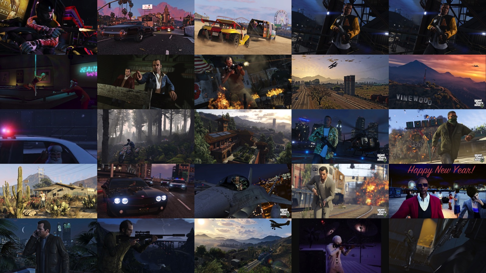
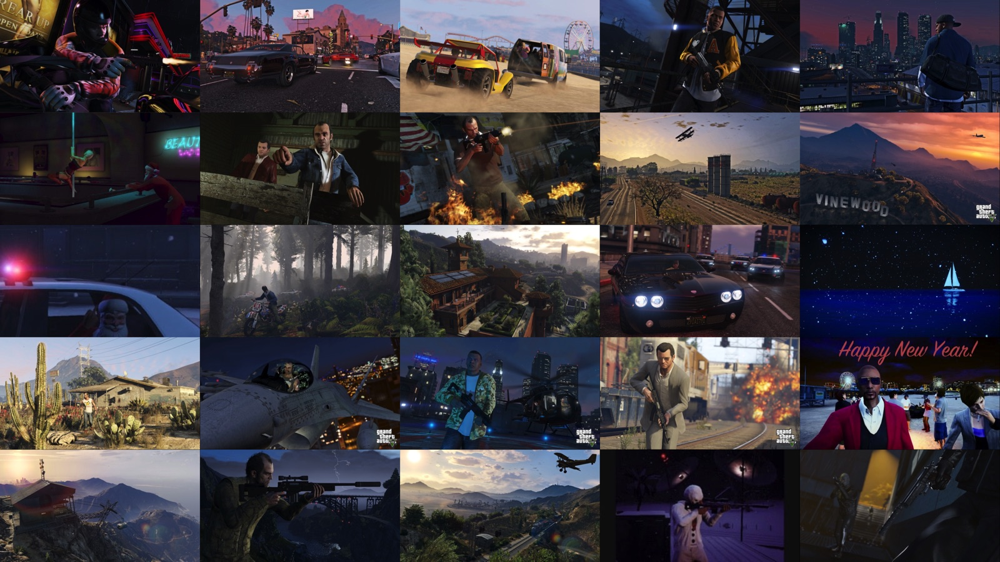

<p align="center">
  
</p>

<h1 align="center">Snapmatic Screensaver</h1>

<p align="center">
  <strong>v1.1</strong><br>
  Open source by <a href="https://github.com/InertiaUX">Inertia</a>
</p>

<p align="center">
  Unofficial revival of Rockstar's GTA V Snapmatic Screensaver (~2013-2014).<br>
  Not affiliated with Rockstar Games or Take-Two Interactive.
</p>

## Why this exists

Rockstar's Snapmatic Screensaver showed a live mosaic of curated GTA V photos on your desktop. The official Mac and PC downloads are gone, Flash is dead, and the Social Club feed is 404.

This project brings it back for nostalgia, and so anyone can run a more modern version today: original mosaic SWF via [Ruffle](https://ruffle.rs/), local photo feed, native shell where we have one.

## Screenshots

<p align="center">
  
</p>

<p align="center">
  
</p>

## Support

| Platform | Download |
|----------|----------|
| **macOS** (Apple Silicon) | [v1.1 arm64](https://github.com/InertiaUX/SnapmaticScreensaver/releases/download/v1.1/Snapmatic-Screensaver-1.1-macOS-arm64.zip) |
| **macOS** (Intel) | [v1.1 x86_64](https://github.com/InertiaUX/SnapmaticScreensaver/releases/download/v1.1/Snapmatic-Screensaver-1.1-macOS-x86_64.zip) |
| **macOS** (universal) | [v1.1 universal](https://github.com/InertiaUX/SnapmaticScreensaver/releases/download/v1.1/Snapmatic-Screensaver-1.1-macOS-universal.zip) |
| **Windows (PC)** | [v1.1 windows-amd64](https://github.com/InertiaUX/SnapmaticScreensaver/releases/download/v1.1/Snapmatic-Screensaver-1.1-windows-amd64.zip) |
| **Linux** | [v1.1 linux-amd64](https://github.com/InertiaUX/SnapmaticScreensaver/releases/download/v1.1/Snapmatic-Screensaver-1.1-linux-amd64.zip) |
| **macOS** Screen Saver (`.saver`) | [v1.1 experimental](https://github.com/InertiaUX/SnapmaticScreensaver/releases/download/v1.1/Snapmatic-Screensaver-1.1-macOS-saver-arm64.zip) |
| **Browser** | Local tryouts (`scripts/run-browser.sh`) |

All releases: [Releases](https://github.com/InertiaUX/SnapmaticScreensaver/releases). Roadmap: [docs/platforms.md](docs/platforms.md).

## Quick start

### macOS

```bash
git clone https://github.com/InertiaUX/SnapmaticScreensaver.git
cd SnapmaticScreensaver
chmod +x apps/mac/build.sh scripts/*.sh
./apps/mac/build.sh                          # Apple Silicon
# ARCH=x86_64 ./apps/mac/build.sh            # Intel
# ARCH=universal ./apps/mac/build.sh         # both
open -a ~/Applications/Snapmatic\ Screensaver.app
```

Or: `./scripts/run-mac.sh`

**Controls:** Esc / Q quit · ⌘Q quit · ⌘Tab / Dock to switch apps

### macOS Screen Saver (experimental)

```bash
./apps/mac-saver/build.sh
```

Installs `~/Library/Screen Savers/Snapmatic.saver`. Pick **Snapmatic** in System Settings → Screen Saver. Newer macOS may need Legacy Screen Savers. Don't run the fullscreen app at the same time (shared feed port).

### Windows / Linux

Prebuilt zips are on the [Releases](https://github.com/InertiaUX/SnapmaticScreensaver/releases) page. Or build:

```bash
./apps/desktop/build.sh
```

Unzip, run `SnapmaticScreensaver.exe` (Windows) or `./SnapmaticScreensaver` (Linux). Needs Chrome, Edge, or Chromium for fullscreen app mode.

**Controls:** Esc or close the browser window · Ctrl+C in the terminal stops the local server

## How it works

1. `web/movie_local.swf`: original mosaic UI, patched to load config from `127.0.0.1:18765`
2. Local XML feed under `web/xxxx/.../snapmaticScreensaver.xml`
3. `web/photos/`: GTA V stills cropped to 640x360
4. Ruffle plays the SWF in a WebView
5. Platform shell: AppKit on macOS, or the portable Go launcher on Windows/Linux (`apps/desktop`)

## Layout

```
apps/mac/          macOS shell (arm64 / x86_64 / universal)
apps/mac-saver/    experimental System Settings .saver
apps/desktop/      Windows + Linux portable launcher
apps/windows/      points at apps/desktop
apps/linux/        points at apps/desktop
web/               SWF, photos, XML feed
vendor/ruffle/     vendored Flash emulator
archives/          original installers + decompiled AS3
docs/              architecture, feed, sourcing, platforms
scripts/           run-mac / run-browser helpers
```

More: [`docs/`](docs/) · provenance: [docs/sourcing.md](docs/sourcing.md) · original Newswire: [rockstargames.com](https://www.rockstargames.com/newswire/article/89k8a554595772/the-snapmatic-screensaver.html)

## License

| Part | Terms |
|------|-------|
| Revival code (shell, scripts, docs, reconstructed feed) | [MIT](LICENSE) |
| Rockstar binaries, SWF, art, photos, decompiled AS3 | Not MIT. Research/preservation only ([NOTICE](NOTICE)) |
| Ruffle | Apache-2.0 / MIT (`vendor/ruffle`) |

Contributions welcome: [CONTRIBUTING.md](CONTRIBUTING.md).
